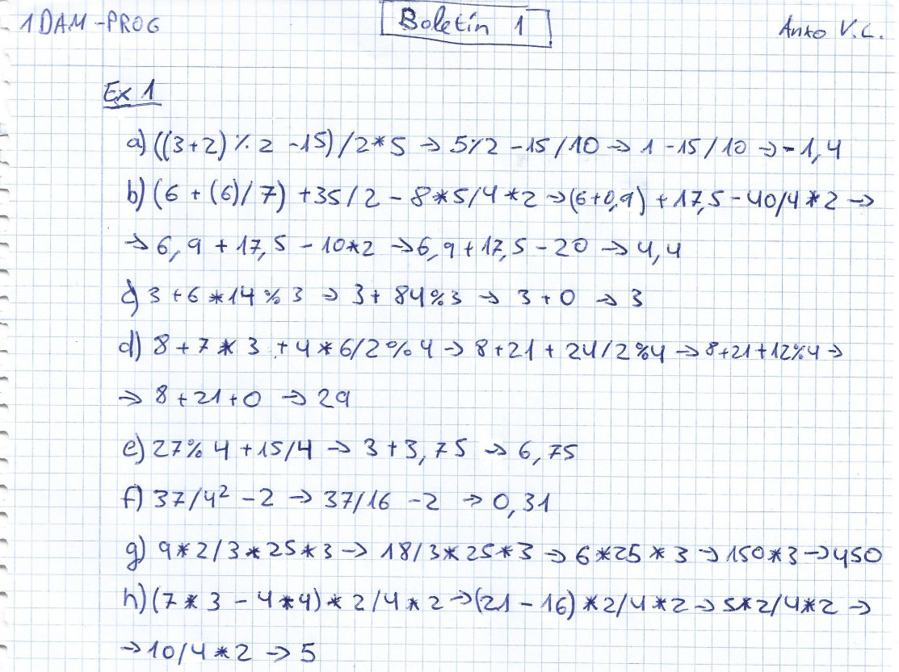
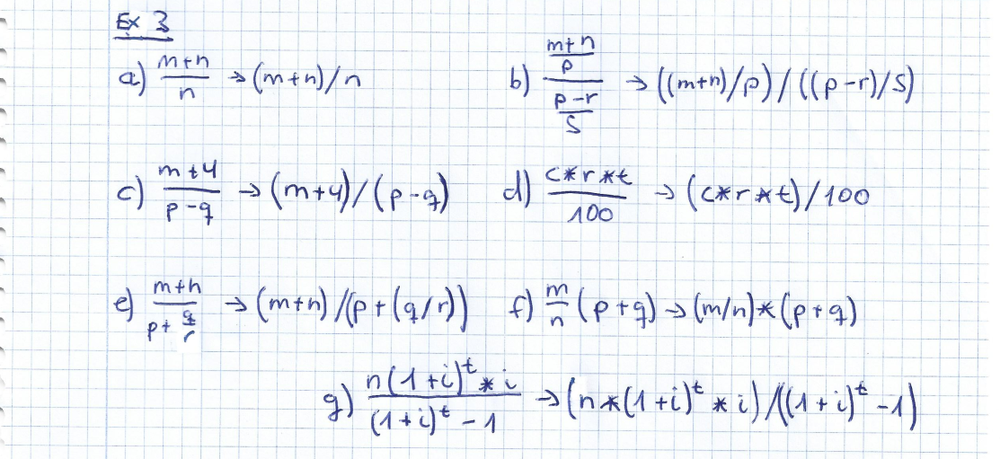

# Exercicio 1

# Exercicio 2

Son válidas as variables: salto_mortal (a), cant_total (b), cant5 (b) e cantidadeTotal (b).

# Exercicio 3

# Exercicio 4

a) Incorrecto

b) Correcto

c) Correcto

d) Correcto

e) Incorrecto

f) Incorrecto, solución "1212"

g) Correcto

h) Correcto

i) Incorrecto, solución 77

# Exercicio 5
a) False

b) True

c) False

d) False

e) False

f) True

g) True
