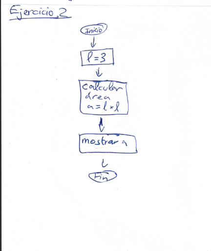
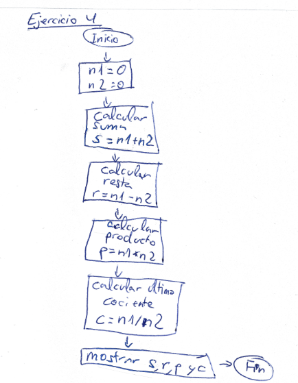
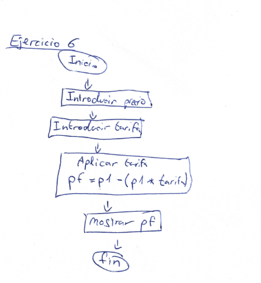
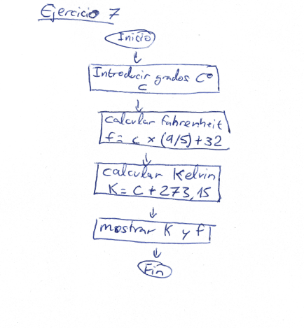

# Boletin 2 - Anxo Vázquez

## Exercicio 1

```
#Ejercicio 1
base = 4
altura = 3
```

## Exercicio 2



## Exercicio 3

```
euros=input("Introduce euros: ")
dolares=float(euros)*1.18
print(dolares)
```

## Exercicio 4




## Exercicio 5

```
millas = input("Introduce cantidad en millas para calcular en metros: ")
metros = int(millas) * 1852
print(metros)
```

## Exercicio 6




## Exercicio 7



